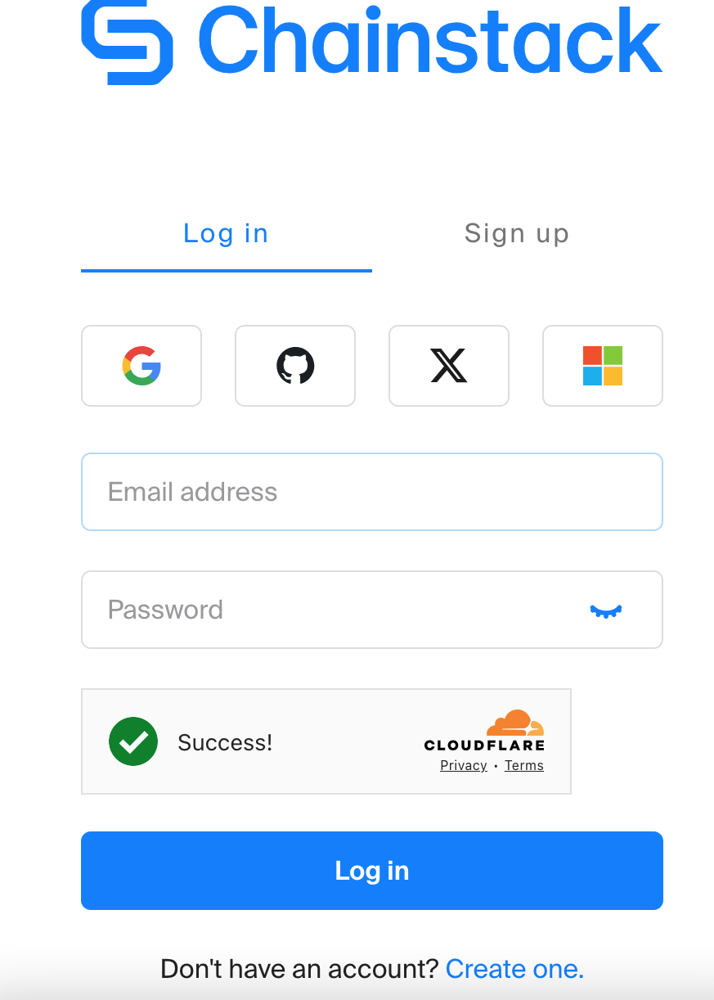
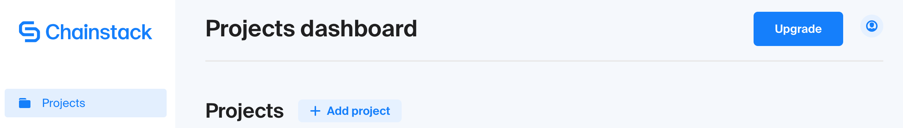
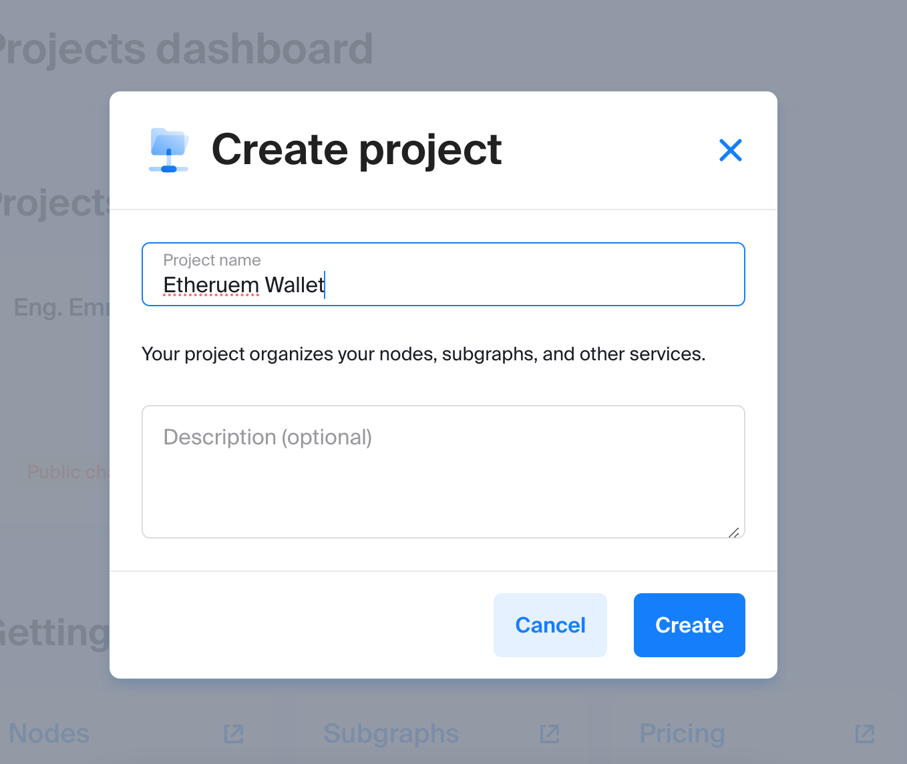
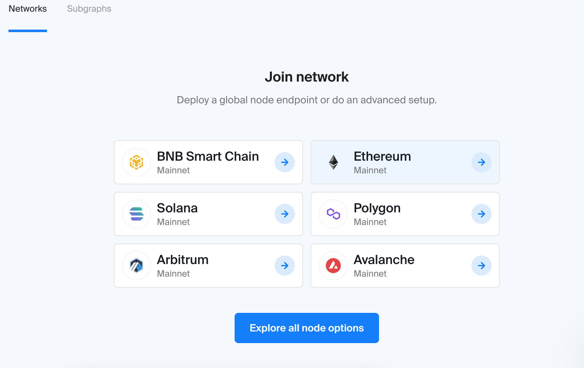
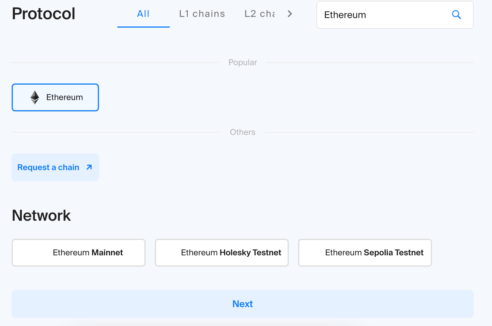
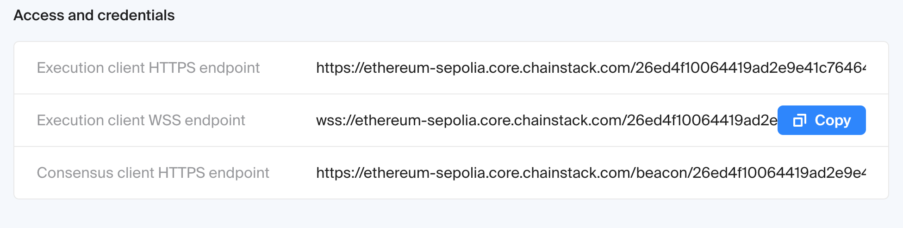

# Getting Started with Chainstack

Chainstack offers managed blockchain services, making it simple to launch and scale decentralized networks and applications.



## 🔐 Create a Chainstack Account

1. **Visit the Chainstack Console**:  
   Navigate to [https://console.chainstack.com/user/login](https://console.chainstack.com/user/login).

2. **Sign Up**:  
   Click on the "Sign up" link.

3. **Provide Your Details**:  
   Enter your email address and create a secure password.

4. **Verify Your Email**:  
   Check your inbox for a verification email from Chainstack and follow the instructions to verify your account.

5. **Complete Your Profile**:  
   Once verified, log in and complete any additional profile information as prompted.


## 🔑 Log In to Your Chainstack Account

1. **Access the Login Page**:  
   Go to [https://console.chainstack.com/user/login](https://console.chainstack.com/user/login).

2. **Enter Credentials**:  
   Input your registered email address and password.

3. **Two-Factor Authentication (If Enabled)**:  
   Enter the authentication code sent to your device or email.

4. **Access Your Dashboard**:  
   Upon successful login, you'll be directed to your Chainstack dashboard.


### 2. **Create a New Project**

- **Initiate a Project**: After logging in, click on the **"Add Project"** button to create your first project


- **Name Your Project**:Provide a name and an optional description for your project, then click **"Create"** 


### 3. **Deploy an Ethereum Node**

- **Select the Network**:Within your project, click on **"Get started"** and choose **Ethereum** as your desired network
- **Choose the Network Type**:Decide between **Mainnet** or a **Testnet** (e.g., Goerli) based on your requirements



- **Configure Node Settings**:
  - **Node Type**:Select between **Shared** or **Dedicated** nodes
  - **Cloud Provider**:Choose your preferred cloud service provider
  - **Geographical Location**:Select a location that offers optimal latency for your operations
- **Deploy the Node**:Click **"Next"**, review your configurations, and then click 

### 4. **Access Node Endpoints and Credentials**

- **Navigate to Node Details**:Once your node is deployed, go to the **"Nodes"** section within your project
- **Retrieve Access Information**:Click on your node to view its details, including
  - **RPC Endpoint (HTTP)**:For standard API interactions
  - **WebSocket Endpoint (WSS)**:For real-time data subscriptions
  - **Authentication Credentials**:Username and password for secured access



### 5. **Integrate with Your Applications**

- **Configure Your Application**:In your application's configuration, set the provider to your node's WebSocket endpoint
- **Example with .env**:
```javascript
ETHEREUM_WS=wss://ethereum-sepolia.core.chainstack.com/26ed4f10064419ad2e9e41c76464a68f
```

## 📘 Additional Resources

- **Official Documentation**: [Chainstack Developer Portal](https://docs.chainstack.cm/)
- **Support**: For assistance, contact ebartile@gmail.com
